# PWA + FirebaseでサーバーレスなTwitterっぽいアプリを作ってみる

## はじめに

これはサーバーレスなPWAアプリを作るハンズオンのためのプロジェクトです。
教育目的であり、段階的にアプリを開発するために「あえて」の作りをしてる部分もありますのでご了承ください。

**PWAである理由**：開発環境、稼働環境が限定されないため<br>
**Firebaseである理由**：個人で完全無料で使えるため<br>
**Twitterである理由**：サーバーレスなDB更新、Notificationを体験できるため<br>

Firebaseは素晴らしいサービスですが特別に推進してるわけではなく、色んなものに触れて、比較して、正しく理解して使いましょう。

## 対象レベル

- HTML/CSS -- 読める（事前準備済み）
- JavaScript -- ES6が読める、調べながら書ける（ほぼ事前準備済み）
- Firebase -- サーバーレスについて意味を知っている

## 目標

クライアントからきっちり作り始めると時間がかかるため。
最低限のクライアント実装を事前に提供し、まずは全体の疎通から始めます。

1. Twitterのようにメッセージを投稿、表示できる。<br>
「いいね」が送れる。ただし、無認証。<br>
**狙い**：MBaaSを使ってサーバーレスなアプリ構築を体験する。<br>
**キーワード**：FireStore, Functions<br>
**所要時間**：2時間<br><br>
2. 1.で作ったアプリにユーザー登録、認証機能を追加する。<br>
ただし、全ての機能が一つの画面に並んで表示されている。<br>
**狙い**：MBaaSを使ってサーバーレスなアプリ構築を体験する。<br>
**キーワード**：Authentication, FireStore<br>
**所要時間**：2時間<br><br>
3. 2.で作ったアプリをSPAにする。<br>
**狙い**：WEBアプリのフロント開発を体験する。<br>
**キーワード**：検討中（2時間じゃ無理なので全部準備？）<br>
**所要時間**：2時間<br><br>


## 事前準備

- NodeJS
-- 割と最新であれば良いです。インストールしてない人はStableの最新を使ってください。Nodist, Nodebrewなどを使い、NodeJSのバージョン管理をできるようにしておいて下さい。
- Googleアカウント
-- 個人アカウントでOK。Firebaseのプロジェクトを作ります（無料）。


## ハンズオン

### 前提
今回用意しているソースおよび手順について、セキュリティや各種ブラウザでの挙動、エラーハンドリングなど適切に実施しているわけではありません。
実際にアプリケーションを開発する際にはご注意ください。


### Firebaseとは？
元々はFirebase社が開発していたモバイルアプリ向けのバックエンドプラットフォーム（MBaaS: Mobile Backend as a Service）です。
2014年にGoogleが買収し、現在はGoogleのクラウド(GCP)上で提供されています。

Googleのアカウントで利用することができ、AWS/GCP/Azureなどと比べるとコンパクトな機能性で、モバイルアプリに必要最低限の機能のみ提供されています。

はっきりと「無料プラン」と書かれている状態で使えるので安心です。

### PWAとは？
PWAはProgressive Web Applicationの略でGoogleが推してるアプリの形式です。WebアプリでありながらNativeの機能も使えるようにするイメージです。例によってiOSでは制約かかってるのでiOSで使うメリットはほぼないです。セキュリティ的にiOSのポリシーとは合わないので今後もiOSの歩み寄りは望み薄いと思います。<br>
しかし、最近ではGoogleがTWA（Trusted Web Activity)としてPWAのアプリをGoogle Playにリリースするための手段を用意したり、MicrosoftがPWAビルダーを用意したりとそれなりの盛り上がりをみせているので、今後まだ発展していく可能性はあります。

PWAのアプリを作る手順はざっくり2つで、HTTPSでホストされる場所にService WorkerというJavaScriptファイルと、JSON形式で書かれたマニフェストファイルを配置するだけです。


### ハンズオンのアーキテクチャ
こんな感じの設計になります。

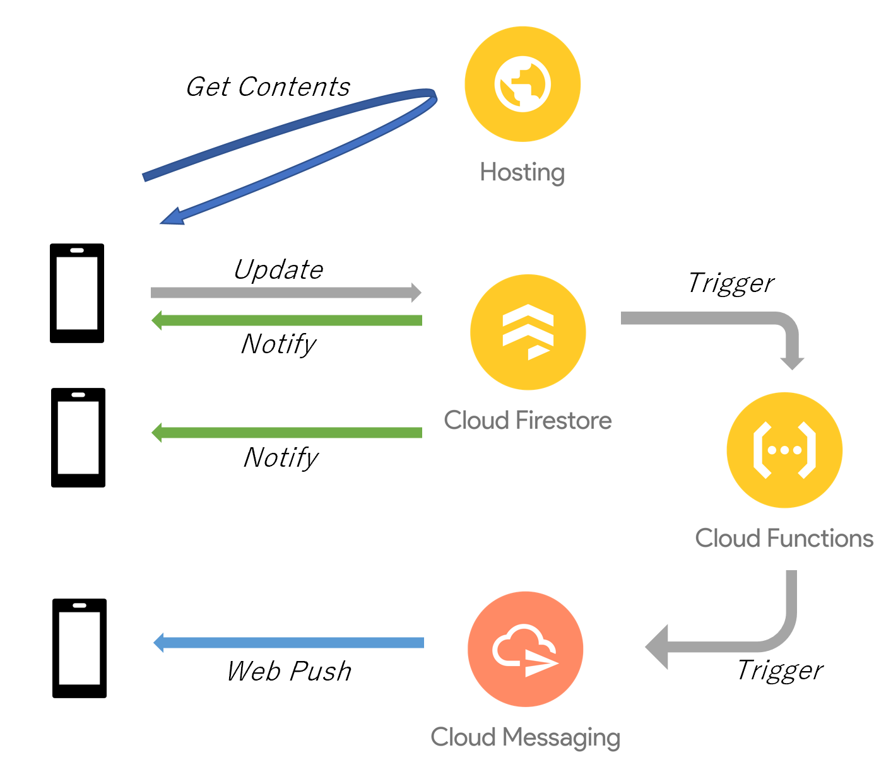
<br>
<br>
<br>


### セットアップ（1）
**この手順は2019年6月時点での手順です。**

Firebaseのコンソールからプロジェクトを追加します<br>
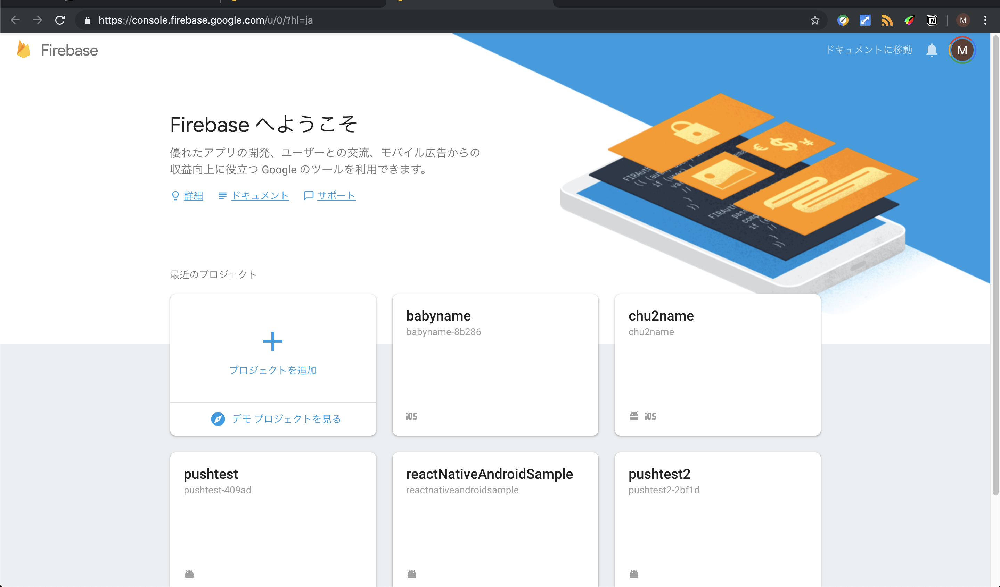
<br>
<br>
<br>

アプリ名は適当に入れてください。<br>
今回はロケーションは選択可能なところであればどこでも良いです。<br>

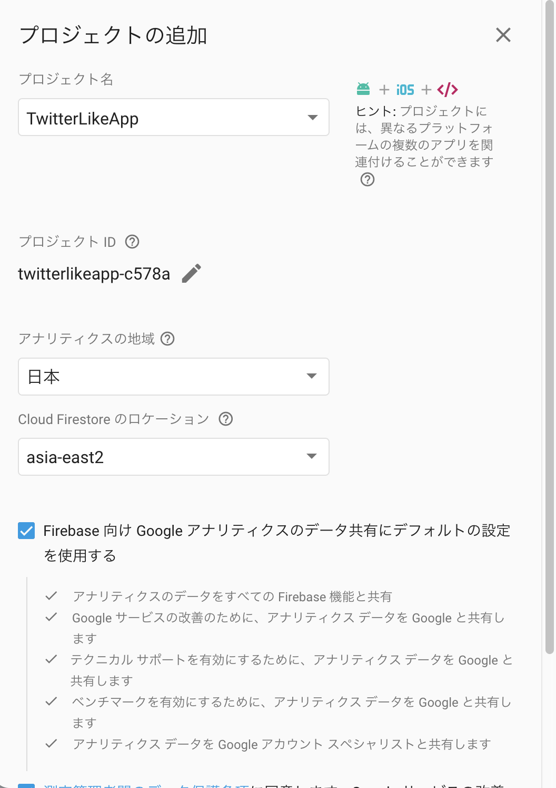
<br>
<br>
<br>

プロジェクト画面に入ったら`</>`のアイコン部分を選択します。<br>
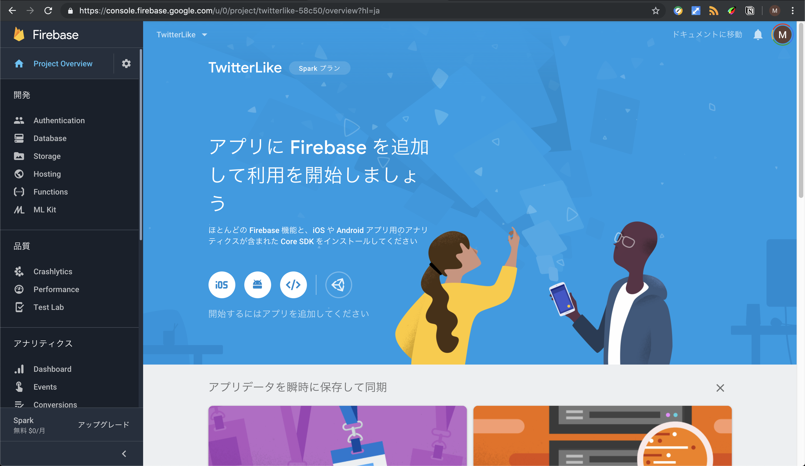

<br>
<br>
<br>

アプリ名は適当に入れてください。<br>
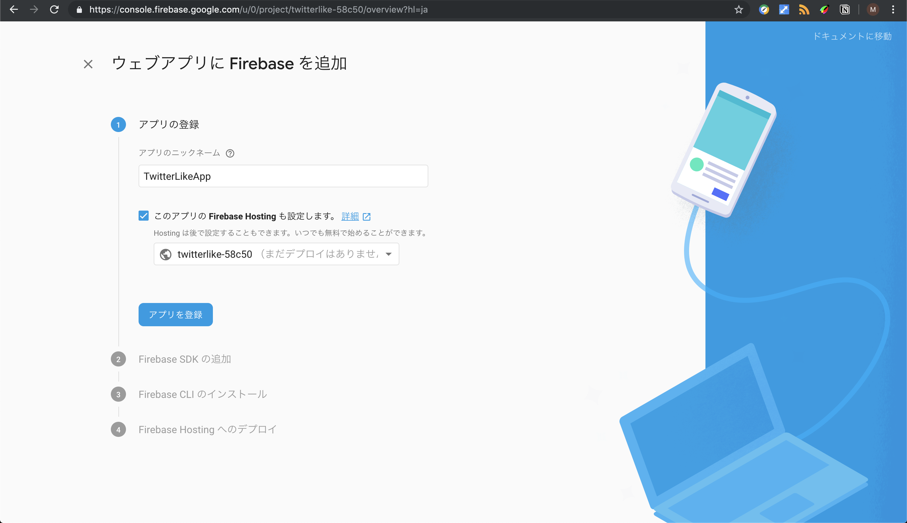
<br>
<br>
<br>

ここは特に何もしなくて良いです。<br>

<br>
<br>
<br>

適当なディレクトリに今回のプロジェクト用ディレクトリを作成し、その中で書いてあるコマンドを実施してください。<br>
`npm install`でパッケージをインストールします。`-g`をつけることでグローバルな場所にインストールします。このコマンドにより、FirebaseのCLIコマンドがコマンドラインから入力できるようになります。
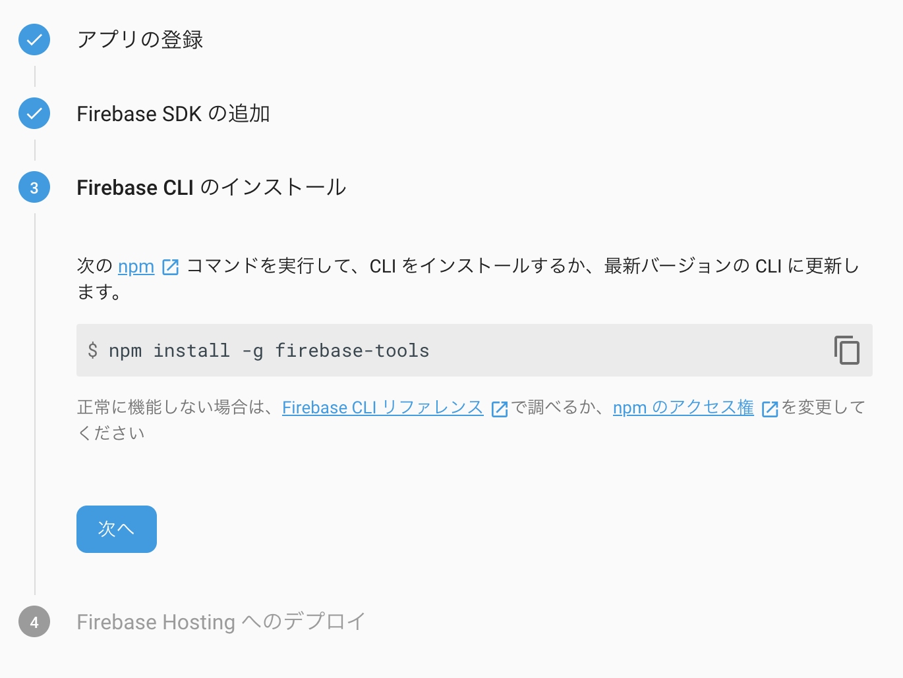
<br>
<br>
<br>

`deploy`以外の書いてあるコマンドを実施します（以降のスクリーンショットに続く）<br>
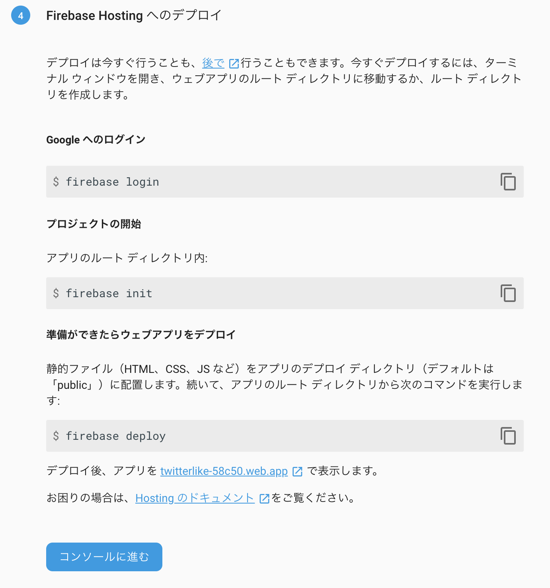
<br>
<br>
<br>

`firebase login`の後にアカウントを聞かれるので、ご自身のGoogleアカウントを入力してください。

`firebase init`を入力して、プロジェクトを初期化します。Firestore, Functions, Hostingを選択してください。選択はスペースキーでします。
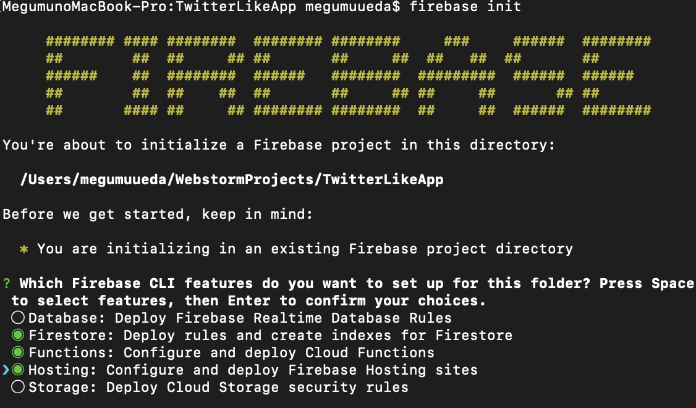
<br>
<br>
<br>

プロジェクトを選択します。今回作ったプロジェクトを選択してください。
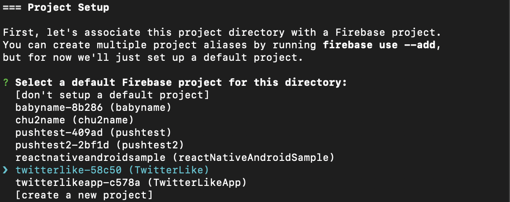
<br>
<br>
<br>

Functionsの言語を選択してください。ここではJavaScriptを選択してください。
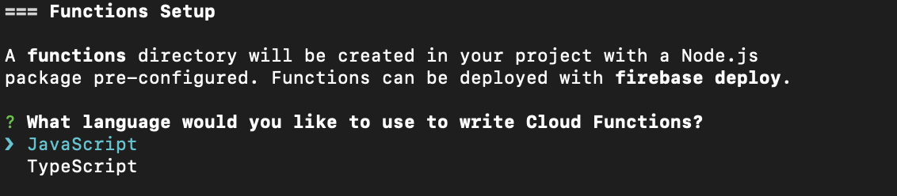
<br>
<br>
<br>

そのほかいろいろ聞かれることはデフォルトのままエンターを押してください。
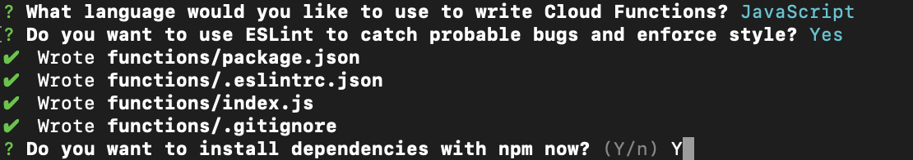

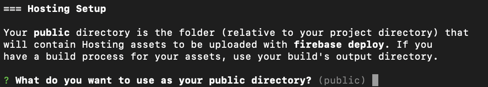
<br>
<br>
<br>

全部実行が終わると、こんな感じのファイルが自動で生成されてます。
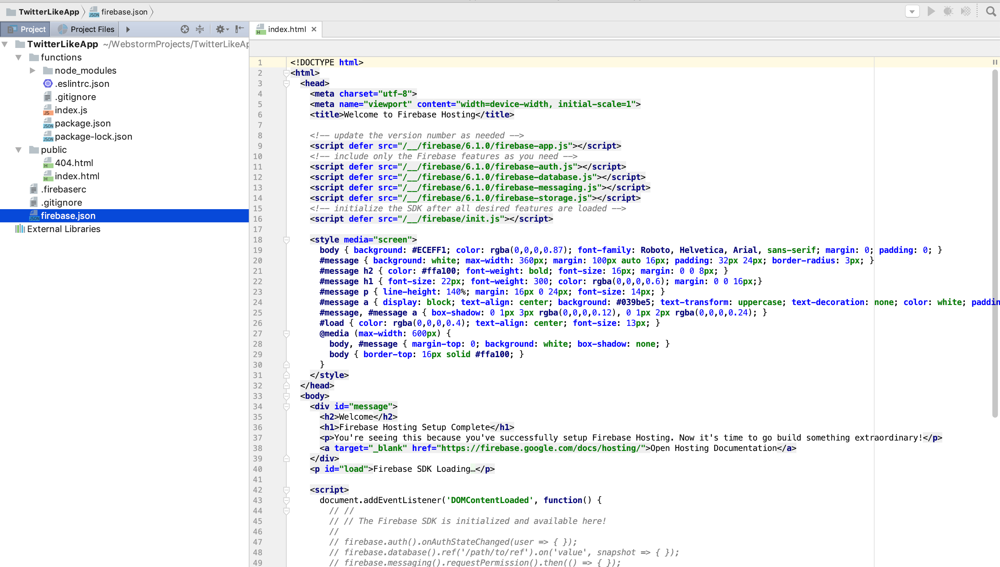
<br>
<br>
<br>

この時点でも`firebase serve`とコマンドを入力して、localhost:5000を開くと画面が表示されます。
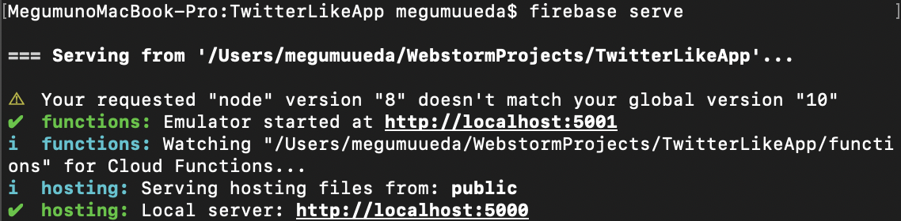
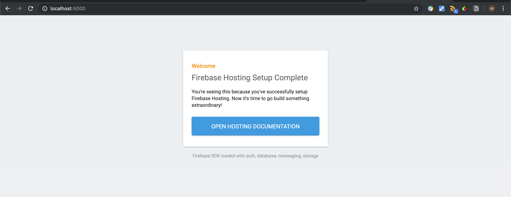


### セットアップ（2）

FirebaseのWEB画面の設定に戻ります。
次は以下の設定を実施していきます。

* クラウドメッセージングのセットアップ
* FireStoreのセットアップ

#### クラウドメッセージングのセットアップ

画面左上にある歯車から`プロジェクトの設定`を選択します。

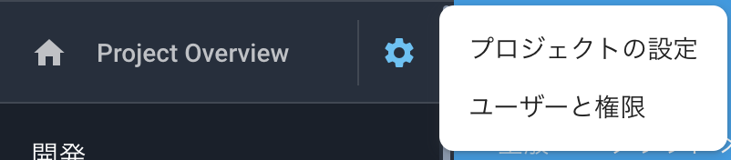
<br>

クラウドメッセージング（FCM)を使える状態にします。
今回はWEBアプリなのでウェブプッシュを使います。
iOS/Androidアプリ以外にもChromeやFirefoxなどのブラウザはNotificationを受信することができます。ただし、iOSはこの機能に対応してないので、受信できるのはPCとAndroidだけになります。

`クラウドメッセージング`のタブを選択し、画面下の方にある`鍵ペアの生成`を選択してください。

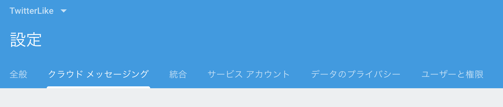
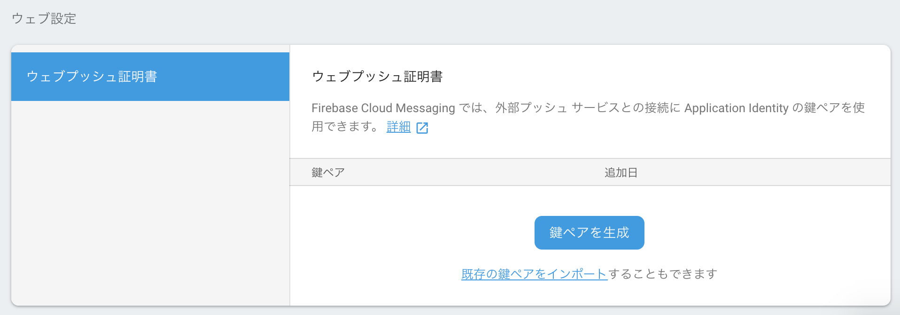
<br>


#### FireStoreのセットアップ

FireStoreはリアルタイムなDBで、API経由でクライアントから直接操作できます。AWSでのAppSyncに相当します。2019年6月時点ではAzureには相当する機能はないです。
次に`Databse`のメニューを選択し、`データベースの作成`を選択して下さい。
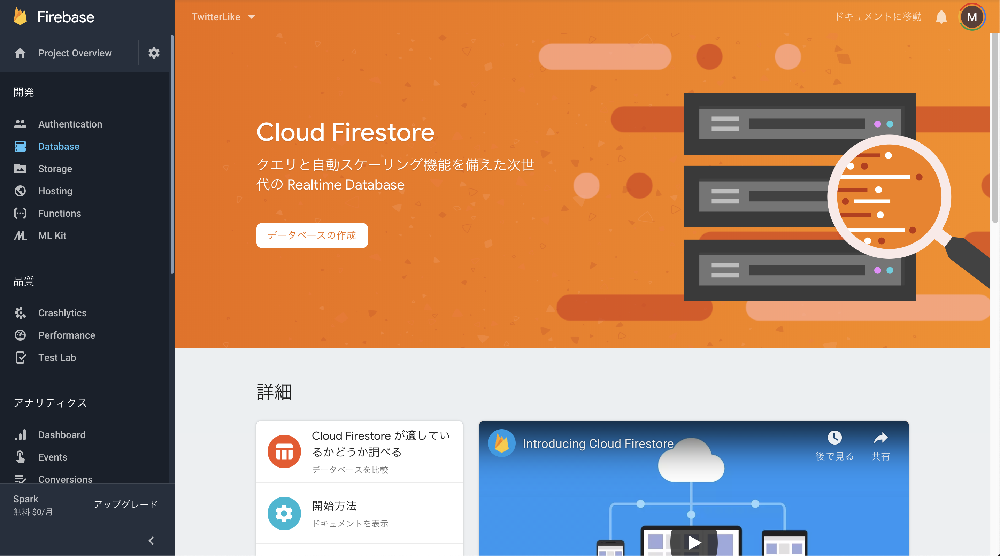
<br>

セキュリテイルールは、認証済みのユーザーが許可された操作だけを実行できるように設定するためのものです。一旦`ロックモードで開始`を選択します。
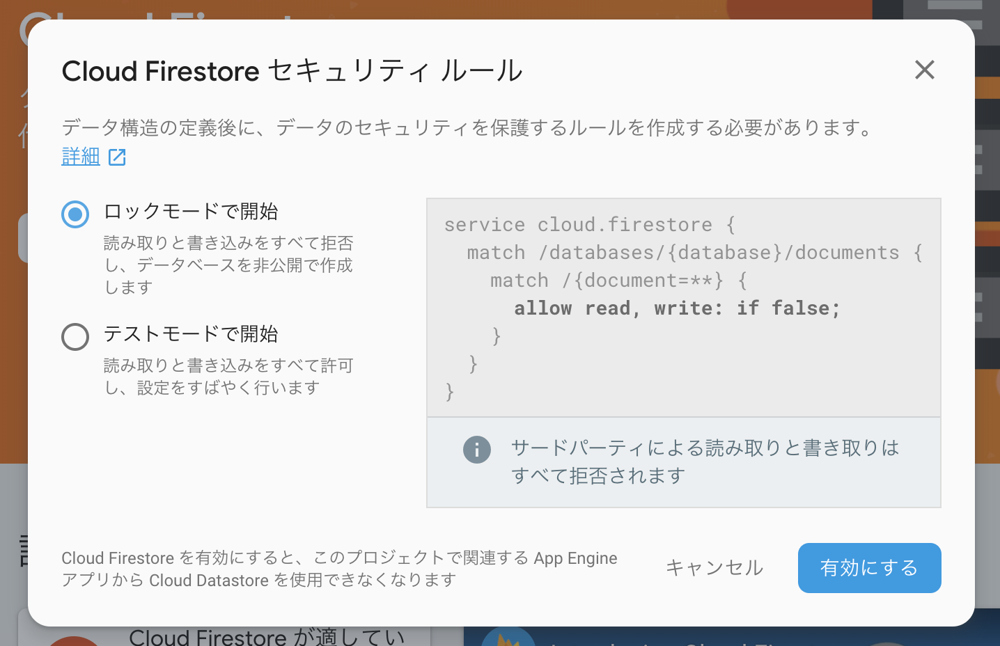
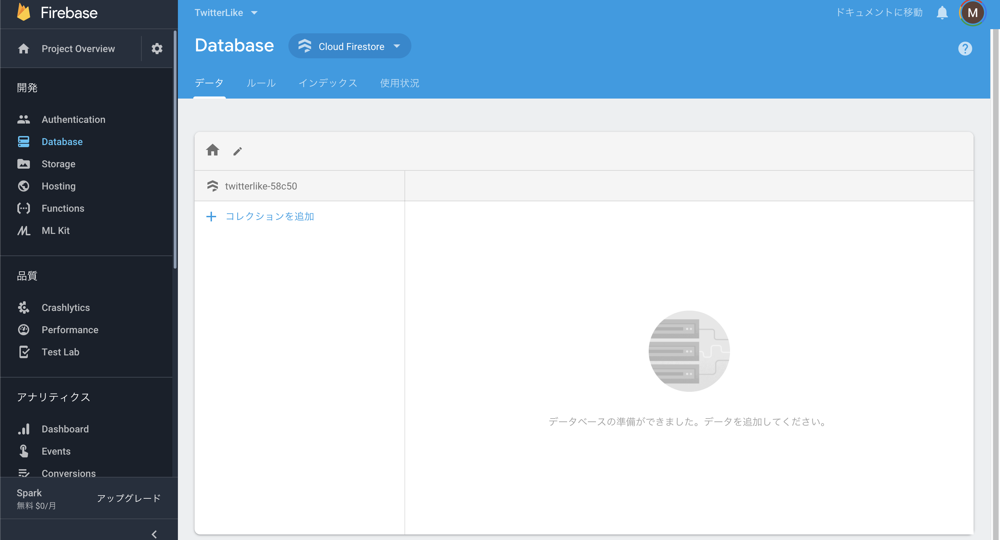
<br>


### 実装

と言っても、用意してるのであまり実装することはありません。
以下の準備をします。

* public/index.html
* public/firebase-messaging-sw.js
* public/manifest.json
* functions/index.js
* firestore.rules


#### public配下の実装

public配下は`Hosting`にアップロードされ、ブラウザから見られるファイルになります。

**public/index.html**

firstStep.htmlの内容をコピペして、`鍵をここに書く`という部分だけ書き換えてください。<br>
鍵は先ほど設定した、`ウェブプッシュ証明書`の`鍵ペア`という部分に書かれてる文字列です。<br>
重厚なJSフレームワークを使うと理解に時間がかかるため、あえてjQueryで書いてます。<br>
`script`には以下の処理が書かれてます。

* Tweetボタンを押した時の処理
* Likeボタンを押した時の処理
* FireStoreからデータを取ってきて表示する処理
* FireStoreに更新があった時の処理
* ウェブプッシュのためのトークン取得処理
<br>
※リプライ、リツイート、DM機能は見た目だけで処理は実装してません
<br>
https://github.com/uemegu/HandsOnTwitterLike1/blob/master/public/firstStep.html
<br>
<br>

**public/firebase-messaging-sw.js**

PWAのService Workerです。このファイル名は固定です。<br>
https://firebase.google.com/docs/cloud-messaging/js/receive

GitHubにあげている以下のファイルをそのまま置いて、`送信者ID`と書かれている部分を自分の送信者IDに書き換えて下さい。
送信者IDはセットアップ(2)で見た`クラウドメッセージング`の画面に書かれてます。
実装内容については見ていただければ、だいたい意味はわかると思います。

https://github.com/uemegu/HandsOnTwitterLike1/blob/master/public/firebase-messaging-sw.js
<br>
<br>

**public/manifest.json**

PWAのマニフェストファイルです。
GitHubにあげている以下のファイルをそのまま置いて下さい。
ここの`gcm_sender_id`は固定値です。
実装内容については見ていただければ、だいたい意味はわかると思います。

https://github.com/uemegu/HandsOnTwitterLike1/blob/master/public/manifest.json
<br>
<br>


**functions/index.js**

Functionsのロジックです。
FunctionsはAWSでのLambda, AzureでのFunctionsにあたります。
今回はクライアント向けのAPIとしては利用せず、FireStoreの更新をトリガーとしてウェブプッシュを送るロジックを書きます。<br>
FireStore＋Functionsのトリガーの組み合わせは非常に強力で、レガシーなシステムでは必要だった多くのWEBアプリサーバーの機能が不要になります。その反面、セキュリティの考慮や呼び出し回数（課金）についてよく検討する必要があります。

GitHubにあげている以下のファイルをそのまま置いて下さい。<br>
内容としては以下の処理を実施しています。
* FireStoreのTweetというコレクションを監視
* 更新があった場合、Tokenというプロパティに入っている値を使ってプッシュを送る
本来であれば、Tokenが有効でなかった場合のお掃除や、更新者自身にプッシュを送らないようにするなどの処理が必要ですが、今回は省いています。

https://github.com/uemegu/HandsOnTwitterLike1/blob/master/functions/index.js
<br>
<br>

Functionsが出来たら、コマンドでアップロードします。<br>
`firebase deploy --only functions`

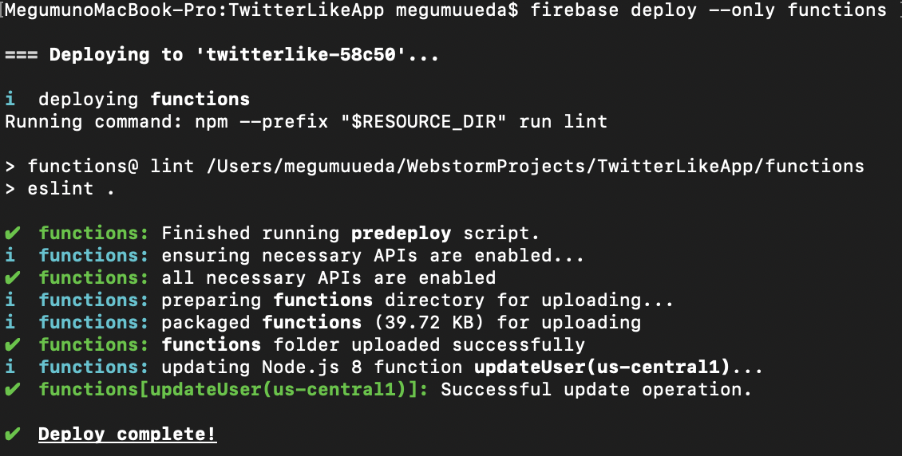
<br>
<br>

**firestore.rules**

FireStoreのセキュリティルールです。<br>
認証については2回目でやるので、今回は無認証にします。<br>
無課金なので不正利用で課金されることはないので安心してください。<br>

````
allow read, write: if false;
````
これの最後の方を消します。
````
allow read, write;
````
<br>
<br>

修正したらコマンドでアップロードします。<br>
`firebase deploy --only firestore:rules`

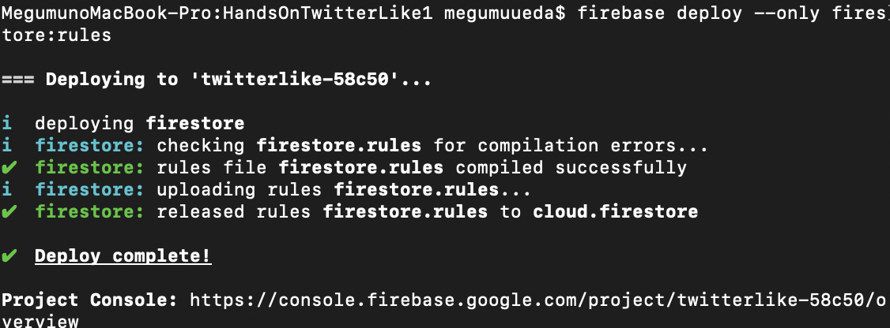
<br>
<br>


### 動かしてみる

`firebase serve`とコマンドを入力して確認してみてください。

２種類のブラウザを起動し、LIKEボタンを押すとリアルタイムで他方に反映されてることが確認できると思います。


<br>
<br>

挙動が確認できたらWeb上にデプロイしてみます。
`firebase deploy --only hosting`と入力してみてください。実施後、コンソールにURLが書かれているので、そのURLを開いてみましょう。
<br>
<br>


## 後片付け

FireStoreを無認証にしてるので、今回のハンズオンが終わった後は全拒否の設定に戻しておきましょう。
次回、認証機能を追加します。
<br>
<br>


## 参考

Firebase CLIリファレンス<br>
https://firebase.google.com/docs/cli/?hl=ja

Firebase Cloud FireStore クイックリファレンス<br>
https://firebase.google.com/docs/firestore/quickstart?hl=ja

Firebase Cloud Messaging (JavaScript)<br>
https://firebase.google.com/docs/cloud-messaging/js/client?hl=ja
