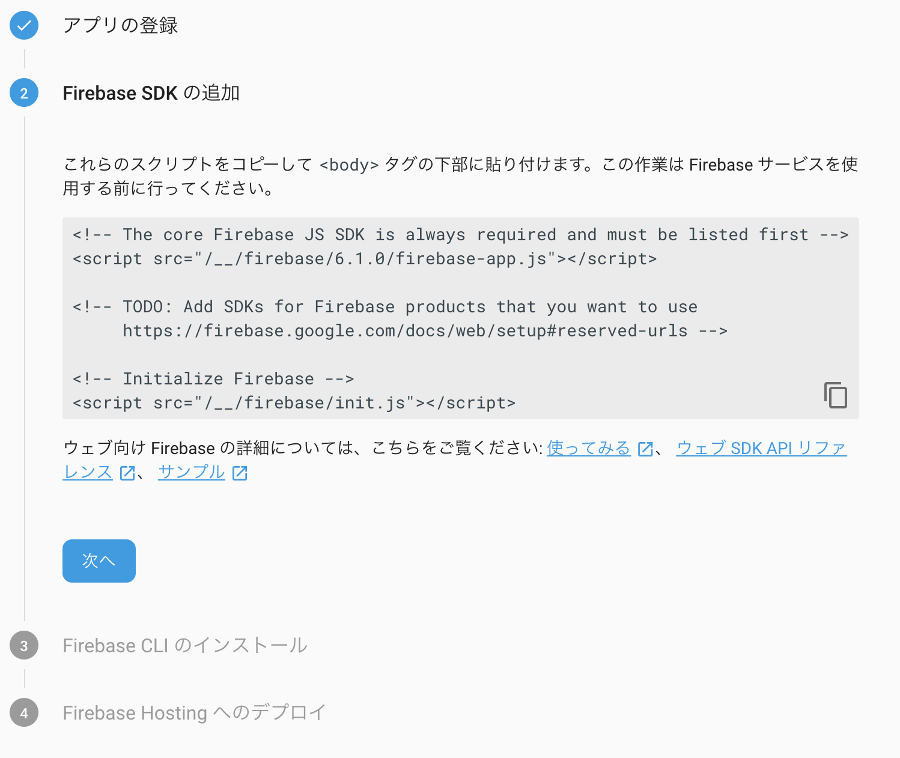

# PWA + FirebaseでサーバーレスなTwitterっぽいアプリを作ってみる

## はじめに

これはサーバーレスなPWAアプリを作るハンズオンのためのプロジェクトです。
教育目的であり、段階的にアプリを開発するために「あえて」の作りをしてる部分もありますのでご了承ください。

**PWAである理由**：開発環境、稼働環境が限定されないため 
**Firebaseである理由**：個人で完全無料で使えるため 
**Twitterである理由**：サーバーレスなDB更新、Notificationを体験できるため 

Firebaseは素晴らしいサービスですが特別に推進してるわけではなく、色んなものに触れて、比較して、正しく理解して使いましょう。

## 対象レベル

- HTML/CSS -- 読める（事前準備済み）
- JavaScript -- ES6が読める、調べながら書ける（ほぼ事前準備済み）
- Firebase -- サーバーレスについて意味を知っている

## 目標

クライアントからきっちり作り始めると時間がかかるため。
最低限のクライアント実装を事前に提供し、まずは全体の疎通から始めます。

1. Twitterのようにメッセージを投稿、表示できる。 
「いいね」が送れる。ただし、無認証。 
**狙い**：MBaaSを使ってサーバーレスなアプリ構築を体験する。 
**キーワード**：FireStore, Functions 
**所要時間**：2時間 
2. 1.で作ったアプリにユーザー登録、認証機能を追加する。 
ただし、全ての機能が一つの画面に並んで表示されている。 
**狙い**：MBaaSを使ってサーバーレスなアプリ構築を体験する。 
**キーワード**：Authentication, FireStore 
**所要時間**：2時間 
3. 2.で作ったアプリをSPAにする。 
**狙い**：WEBアプリのフロント開発を体験する。 
**キーワード**：検討中（2時間じゃ無理なので全部準備？） 
**所要時間**：2時間 

## 事前準備

- NodeJS
-- 割と最新であれば良いです。インストールしてない人はStableの最新を使ってください。Nodist, Nodebrewなどを使い、NodeJSのバージョン管理をできるようにしておいて下さい。
- Googleアカウント
-- 個人アカウントでOK。Firebaseのプロジェクトを作ります（無料）。

## ハンズオン

### Firebaseのセットアップ

#### Firebaseとは？
元々はFirebase社が開発していたモバイルアプリ向けのバックエンドプラットフォーム（MBaaS: Mobile Backend as a Service）です。
2014年にGoogleが買収し、現在はGoogleのクラウド(GCP)上で提供されています。

Googleのアカウントで利用することができ、AWS/GCP/Azureなどと比べるとコンパクトな機能性で、モバイルアプリに必要最低限の機能のみ提供されています。

はっきりと「無料プラン」と書かれている状態で使えるので安心です。

#### セットアップ（1）
Firebaseのコンソールからプロジェクトを追加します 

 
アプリ名は適当に入れてください。 
今回はロケーションは選択可能なところであればどこでも良いです。 

プロジェクト画面に入ったら`</>`のアイコン部分を選択します。 

 
 
アプリ名は適当に入れてください。 

ここは特に何もしなくて良いです。 

適当なディレクトリに今回のプロジェクト用ディレクトリを作成し、その中で書いてあるコマンドを実施してください。 
`npm install`でパッケージをインストールします。`-g`をつけることでグローバルな場所にインストールします。このコマンドにより、FirebaseのCLIコマンドがコマンドラインから入力できるようになります。

`deploy`以外の書いてあるコマンドを実施します（以降のスクリーンショットに続く） 

`firebase login`の後にアカウントを聞かれるので、ご自身のGoogleアカウントを入力してください。

`firebase init`を入力して、プロジェクトを初期化します。Firestore, Functions, Hostingを選択してください。選択はスペースキーでします。

プロジェクトを選択します。今回作ったプロジェクトを選択してください。

Functionsの言語を選択してください。ここではJavaScriptを選択してください。

そのほかいろいろ聞かれることはデフォルトのままエンターを押してください。

全部実行が終わると、こんな感じのファイルが自動で生成されてます。

#### セットアップ（2）

FirebaseのWEB画面の設定に戻ります。
次は以下の設定を実施していきます。

* クラウドメッセージングのセットアップ
* FireStoreのセットアップ

##### クラウドメッセージングのセットアップ

画面左上にある歯車から`プロジェクトの設定`を選択します。

クラウドメッセージング（FCM)を使える状態にします。
今回はWEBアプリなのでウェブプッシュを使います。
iOS/Androidアプリ以外にもChromeやFirefoxなどのブラウザはNotificationを受信することができます。ただし、iOSはこの機能に対応してないので、受信できるのはPCとAndroidだけになります。

`クラウドメッセージング`のタブを選択し、画面下の方にある`鍵ペアの生成`を選択してください。

##### FireStoreのセットアップ

次に`Databse`のメニューを選択し、`データベースの作成`を選択して下さい。

セキュリテイルールは、認証済みのユーザーが許可された操作だけを実行できるように設定するためのものです。一旦`ロックモードで開始`を選択します。

#### 実装

と言っても、用意してるのであまり実装することはありません。
以下の準備をします。

* public/index.html
* public/firebase-messaging-sw.js
* public/manifest.json
* functions/index.js
* firestore.rules

##### public配下の実装

public配下は`Hosting`にアップロードされ、ブラウザから見られるファイルになります。

* index.html

## 参考

Firebase CLIリファレンス 
https://firebase.google.com/docs/cli/?hl=ja

Firebase Cloud FireStore クイックリファレンス 
https://firebase.google.com/docs/firestore/quickstart?hl=ja

Firebase Cloud Messaging (JavaScript) 
https://firebase.google.com/docs/cloud-messaging/js/client?hl=ja